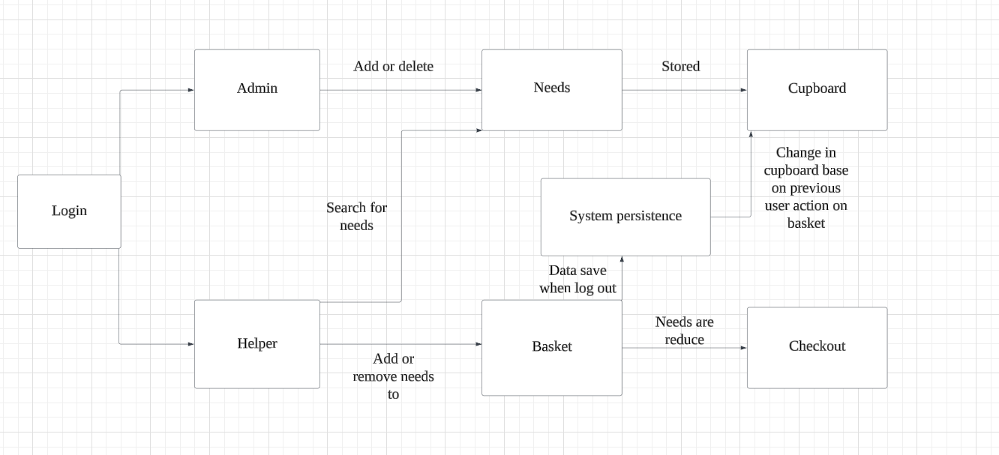
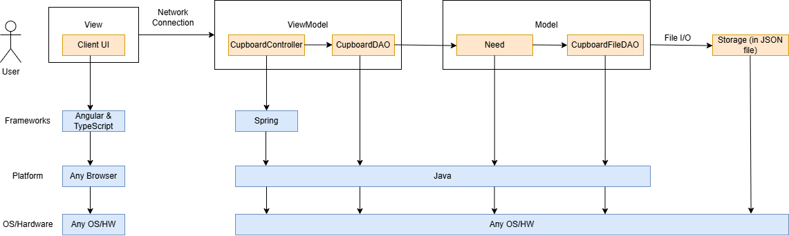
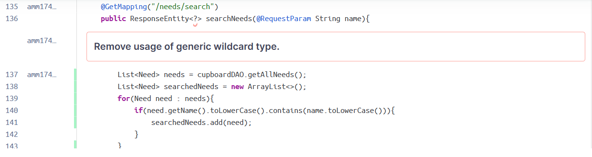
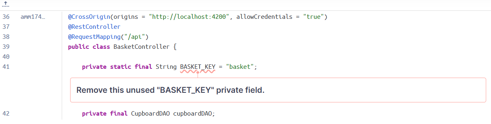
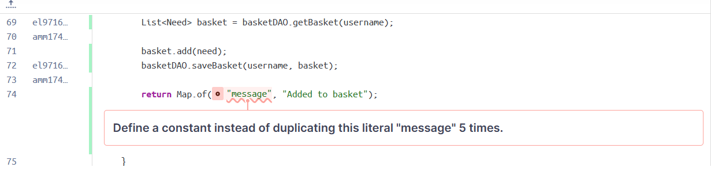
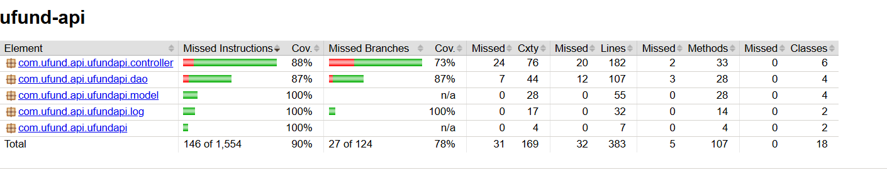

# PROJECT Design Documentation

> _The following template provides the headings for your Design
> Documentation.  As you edit each section make sure you remove these
> commentary 'blockquotes'; the lines that start with a > character
> and appear in the generated PDF in italics but do so only **after** all team members agree that the requirements for that section and current Sprint have been met. **Do not** delete future Sprint expectations._

## Team Information
* Team name: 6f
* Team members
  * Eric Zheng Wu
  * Evan Lin
  * Alexandra Mantagas
  * Sophia Le

## Executive Summary

This project revolves around making a website to help communities affected by wildfires by connecting them with donors to provide them with any needs they may require. Relief organizations sometimes struggle to manage and track these needs effectively, so we're creating a simple solution that is user-friendly to make the process easier. 

### Purpose
>  _**[Sprint 2 & 4]** Provide a very brief statement about the project and the most
> important user group and user goals._

The U-Fund project is a web-based platform designed to help community with financial assistance. 
It allows users to create and contribute to funding requests for essential needs. 
The primary user groups include individuals seeking financial support and donors willing to contribute. 

### Glossary and Acronyms
> _**[Sprint 2 & 4]** Provide a table of terms and acronyms._

| Term | Definition                       |
|------|----------------------------------|
| SPA  | Single Page                      |
| API  | Application Programming Interface|
| HTTP | Hypertext Transfer Protocol      |
| CRUD | Create, Read, Update, Delete     |
| REST | Representational State Transfer  |
| DAO  | Data Access Object               |

## Requirements

This section describes the features of the application.

> _In this section you do not need to be exhaustive and list every
> story.  Focus on top-level features from the Vision document and
> maybe Epics and critical Stories._

### Definition of MVP
> _**[Sprint 2 & 4]** Provide a simple description of the Minimum Viable Product._

> _Sprint 2_
The Minimum Viable Product (MVP) aims to provide a foundational system for managing a needs cupboard. The system supports basic user authentication and role-based access, where users can be Admins or Helpers. Admins have elevated permissions to manage inventory, view and edit user data, and oversee the system, while Helpers can view and fulfill requests. The core entity of the system is the Basket, which represents a collection of needs selected by a user.

The MVP includes:
> _User Authentication: Users must be able to log in and log out with credentials. Password validation and basic session control are implemented to secure the system.

> _Data Management: A DAO (Data Access Object) layer handles persistent storage using file-based systems (CupboardDAO.java, CupboardFileDAO.java), supporting full CRUD (Create, Read, Update, Delete) operations on inventory and user data.

> _Application Logic: Controllers (CupboardController.java, InventoryController.java) process incoming requests and coordinate interactions between the user interface and data layers to manage cupboard inventory, user accounts, and basket contents.

### MVP Features
>  _**[Sprint 4]** Provide a list of top-level Epics and/or Stories of the MVP._
As a user, I can log in and log out of the system using a simple username input.

As an Admin (U-Fund Manager), I can add, edit, and remove needs in the Needs Cupboard.

As a Helper, I can browse and search through needs posted by organizations.

As a Helper, I can add needs to my Funding Basket and proceed to a checkout process.

As a system, I persist all needs and funding data to files so that changes are retained between sessions.

As a Helper, I see only what I’m permitted to see (i.e., not admin tools), and vice versa for the Admin.

### Enhancements
> _**[Sprint 4]** Describe what enhancements you have implemented for the project._

Rewards System: Rewards Helpers for reaching certain milestones such as completing their first purchase or making the most purchases so that Helpers are incentivized to continue supporting needs. Adds a gamified layer to the platform and encourages engagement

Notification System: Notifies other users when a Helper completes a purchase. Alerts users about a change in the Needs Cupboard. This keeps the experience dynamic and gives Helpers a real-time view of the evolving needs landscape, enhancing a sense of community contribution.

## Application Domain

This section describes the application domain.

> _**[Sprint 2 & 4]** Provide a high-level overview of the domain for this application. You
> can discuss the more important domain entities and their relationship
> to each other._
>
> User: A person using the system, either a Helper or a U-Fund manager. Can
> interact with Needs and Funding Basket.
> 
> Need: A request for resources. Stored in Cupboard, managed by U-Fund managers,
> funded by Helpers.
>
> Cupboard: Holds all active Needs. Accessed by U-Fund managers.
>
> Funding Basket: A temporary selection of Needs a Helper wants to fund. Belongs to a specific Helper.
>
> Authentication System: Manages user login and role-based access. Determines if user is a Helper or a U-Fund Manager. 
> 
> Rewards: A popup for Helpers after they make a purchase in the funding basket and reach a milestone such as first purchase or most purchases
> 
> Notifications: Window appears in the Helper dashboard displaying history of user purchases every time a Helper makes a purchase

## Architecture and Design

This section describes the application architecture.

### Summary

The following Tiers/Layers model shows a high-level view of the webapp's architecture. 
**NOTE**: detailed diagrams are required in later sections of this document.
> _**[Sprint 1]** (Augment this diagram with your **own** rendition and representations of sample system classes, placing them into the appropriate M/V/VM (orange rectangle) tier section. Focus on what is currently required to support **Sprint 1 - Demo requirements**. Make sure to describe your design choices in the corresponding _**Tier Section**_ and also in the _**OO Design Principles**_ section below.)_

The web application, is built using the Model–View–ViewModel (MVVM) architecture pattern. 

The Model stores the application data objects including any functionality to provide persistance. 

The View is the client-side SPA built with Angular utilizing HTML, CSS and TypeScript. The ViewModel provides RESTful APIs to the client (View) as well as any logic required to manipulate the data objects from the Model.

Both the ViewModel and Model are built using Java and Spring Framework. Details of the components within these tiers are supplied below.

### Overview of User Interface

This section describes the web interface flow; this is how the user views and interacts with the web application.

> _Provide a summary of the application's user interface.  Describe, from the user's perspective, the flow of the pages/navigation in the web application.
>  (Add low-fidelity mockups prior to initiating your **[Sprint 2]**  work so you have a good idea of the user interactions.) Eventually replace with representative screen shots of your high-fidelity results as these become available and finally include future recommendations improvement recommendations for your **[Sprint 4]** )_

### View Tier
The View Tier is responsible for managing the user interface and all user interactions. It acts as the entry point for both wildfire relief managers (U-Fund Managers) and helpers (supporters), providing tailored experiences based on their roles. This tier includes the following components:

Landing Page: Acts as the main entry point of the application. It provides options to login as either a helper or U-Fund manager and introduces users to the purpose of the platform.

Login Page: Simple username-based login interface. If the username is admin, the user is logged in as a U-Fund Manager; otherwise, they are a helper.

Helper Dashboard: Displays all current wildfire relief needs from the cupboard. Helpers can search, filter, and view detailed information about each need. From here, they can add needs to their personal funding basket.

Funding Basket Page: Shows all the needs added by a helper. Allows them to modify quantities or remove needs before proceeding to checkout.

Checkout Page: Final step in the donation process. The helper can review and confirm their donation. Once completed, needs are updated in the cupboard and other helpers are notified via the Notification system (enhancement).

Manager Dashboard: Allows U-Fund Managers to create, update, or delete wildfire relief needs in their organization’s cupboard. Changes are persisted and reflected in the system.

Notification Display (Enhancement): Notifies helpers in real-time when any need is updated, funded, or fulfilled by another user.

Reward Display (Enhancement): Shows rewards to helpers based on their contributions — e.g. a badge for first donation or leaderboard for most funded needs.

> _Helper Donates to a Need

> _Manager Updates a Need

### ViewModel Tier
The ViewModel Tier serves as a mediator between the user interface (View Tier) and the business logic/data layer (Model Tier). It translates user actions into commands that interact with the data model and then prepares the results for display in the View.

This tier includes:

LoginViewModel: Handles logic for determining user roles based on input. It ensures that the system presents the correct UI (Helper vs Manager) based on the login credentials.

NeedListViewModel: Coordinates between the CupboardDAO and the front-end view. Retrieves all current needs for display and filters based on search queries.

BasketViewModel: Maintains the state of a helper’s funding basket, handles add/remove operations, and manages the transition to the checkout process.

ManagerViewModel: Interfaces with the CupboardDAO to update the cupboard contents. Enables managers to add new needs or edit/delete existing ones.

NotificationViewModel (Enhancement): Collects and formats real-time changes to needs and triggers notifications for helpers.

RewardViewModel (Enhancement): Tracks helper activity and updates the reward system accordingly.

### Model Tier
The Model Tier is responsible for data representation, persistence, and core business logic. It stores all information about wildfire relief needs and user activity and ensures consistent state throughout the system.

This tier includes the following key components:

Need: Core data model representing a single wildfire relief need. It includes attributes such as id, name, description, cost, quantity, and urgency.

Cupboard: Contains a list of all current needs and serves as the authoritative source for what is available to be funded.

CupboardFileDAO: Responsible for reading from and writing to JSON files to persist the state of the cupboard across sessions.

Notification (Enhancement): Represents an update or alert triggered by a change to any need — such as a new need being added or one being fulfilled.

Reward (Enhancement): Represents reward objects like badges or achievements given to helpers based on their funding behavior.

Helper: Represents a logged-in user (non-admin) and tracks their activity including current basket and reward status.

## OO Design Principles

> _**[Sprint 1]** Name and describe the initial OO Principles that your team has considered in support of your design (and implementation) for this first Sprint._

> _Single Responsibility Principle (SRP): Need is responsible only for storing data about a need._

> _Open/Closed Principle (OCP): CupboardDAOs is an interface which allows for future modifications without changing the existing logic._

> _Controller: Component that manages user input and interacts with the model and view to process requests and update the user interface._

> _Pure Fabrication: Designed to improve the overall system by encapsulating complex logic or providing a clean interface between > other classes._
> _Dependency Inversion/Injection:  important parts of the code should not rely on details. They should rely on general ideas or rules. We follow this by using interfaces._

> _Law of Demeter: The object should know as little as possible about the others, basically everything should be private. Other objects should not have direct access to the data. For example, the getters we use._

> _Low Coupling: One person can edit the interface while another team member can work on the backend development at the same time._

> _Low Coupling: The Need class is the information expert for all need-related data._

> _**[Sprint 2, 3 & 4]** Will eventually address upto **4 key OO Principles** in your final design. Follow guidance in augmenting those completed in previous Sprints as indicated to you by instructor. Be sure to include any diagrams (or clearly refer to ones elsewhere in your Tier sections above) to support your claims._
>
OO PRINCIPLE #1: Single responsibility. This principle states that a class should have only one reason to change (it should only have one job). We applied this in our project by separating concerns across multiple different classes, and making sure each class has a focused purpose. For example, with the Need management system, everything was broken down into different parts. The Need Class (Model Layer) represents an individual need and only contains data and basic validation. Next, the CupboardDAO Interface defines operations for adding, retrieving, updating, and deleting needs from the cupboard. After that, the CupboardFileDAO (Persistence Layer) implements CupboardDAO and handles the file-based data storage. It ensures that anything to do with persistence is separate from the business login. Finally, CupboardController handles HTTP requests/responses for needs operations. This allows for easier maintenance and better readability.
>
OO PRINCIPLE #2: Open/closed principle. This principle states that a class should be open for extension but closed for modification (new functionality can be added without changing existing code). We applied this by making key components extensible, instead of having modifications be made to existing code. For example, the LoginService class determines user roles based on their username (admin = U-Fund Manager, anything else = Helper). In the future, if another role needs to be added, we can extend the system instead of modifying the existing logic. In addition, instead of hardcoding different need categories, we could use polymorphism to add these things easily and without modifying existing code. This allows for easier expansion of our code in the future.
>
OO PRINCIPLE #3: Dependency Inversion Principle. This principle states that high-level modules should not depend on low-level modules; they should both depend on abstractions. In our project, we follow this by having services and controllers depend on interfaces instead of actual implementations. For example, CupboardController interacts with CupboardDAO, not directly with CupboardFileDAO. This makes the system easier to test mocks, and makes it easier to adapt in the future without having to rewrite service logic.
>
OO PRINCIPLE #4: Liskov Substitution Principle (LSP). This principle states that objects of a superclass should be replaceable with objects of a subclass without altering the correctness of the program. In other words, if class S is a subtype of class T, we should be able to replace T with S without breaking functionality. We applied LSP in our project through the use of interfaces and subclass implementations. A good example is the use of the CupboardDAO interface. CupboardFileDAO implements CupboardDAO and can be used interchangeably wherever CupboardDAO is expected. For example, CupboardController only depends on CupboardDAO, so we can substitute CupboardFileDAO or any future subclass (e.g., CupboardDatabaseDAO) without changing how the controller behaves. This follows LSP by allowing polymorphic behavior and making our code more modular and flexible for future enhancements (like switching to a database-backed storage system).

> _**[Sprint 3 & 4]** OO Design Principles should span across **all tiers.**_

## Static Code Analysis/Future Design Improvements
> _**[Sprint 4]** With the results from the Static Code Analysis exercise, 
> **Identify 3-4** areas within your code that have been flagged by the Static Code 
> Analysis Tool (SonarQube) and provide your analysis and recommendations.  
> Include any relevant screenshot(s) with each area._

The return type is written as ResponseEntity<?>, which means "this could return anything." But in this method, you always return a list of Need objects, not just anything. Using <?> makes the method less clear. Other developers won’t know what to expect from this endpoint. It also makes the code harder to read and work with later on. We can change it to ResponseEntity<List<Need>>, by doing this, we could make the code clearer to the user

Another problem is that we had an unused private field; removing it helps keep the code cleaner, easier to understand, and less error-prone.

Repeating the same string in multiple places makes it harder to update later, since you’d have to change every copy. We can fix the issue by defining a constant for this. 

> _**[Sprint 4]** Discuss **future** refactoring and other design improvements your team would explore if the team had additional time._

Our current design effectively applies key object-oriented principles like Single Responsibility and Dependency Inversion, but could better implement other principles. Future improvements should focus on strengthening type safety by replacing generic returns with specific types. We should also introduce better notification implementations and standardize error handling. 

## Testing
> _This section will provide information about the testing performed
> and the results of the testing._

### Acceptance Testing
> _**[Sprint 2 & 4]** Report on the number of user stories that have passed all their
> acceptance criteria tests, the number that have some acceptance
> criteria tests failing, and the number of user stories that
> have not had any testing yet. Highlight the issues found during
> acceptance testing and if there are any concerns._
>
Sprint 2: Login System user story passed all acceptance criteria tests.

Sprint 2: Search for a need user story passed all acceptance criteria tests.

Sprint 2: Add/remove a helper user story passed all acceptance criteria tests.

Sprint 2: Add/remove/edit needs user story passed all acceptance criteria tests.

Sprint 2: Create admin account, funding basket obscurity not tested. 

### Unit Testing and Code Coverage
> _**[Sprint 4]** Discuss your unit testing strategy. Report on the code coverage
> achieved from unit testing of the code base. Discuss the team's
> coverage targets, why you selected those values, and how well your
> code coverage met your targets._
> 

>_**[Sprint 2, 3 & 4]** **Include images of your code coverage report.** If there are any anomalies, discuss
> those._

Sprint 2:

Sprint 3:

We did not run into any anomalies while testing. 

## Ongoing Rationale
>_**[Sprint 1, 2, 3 & 4]** Throughout the project, provide a time stamp **(yyyy/mm/dd): Sprint # and description** of any _**mayor**_ team decisions or design milestones/changes and corresponding justification._
>
2025/03/03: Sprint 2, implemented basic login system where user can log in as either a U-Fund Manager or a Helper.

2025/03/18: Sprint 2, implemented manager dashboard and ability for manager to add/remove/edit needs.

2025/03/19: Sprint 2, implemented helper dashboard and ability for helper to add/remove needs to their basket and search for needs. 

2025/04/07: Sprint 3, implemented notification system to give users notifications when other users have made purchases.

2025/04/07: Sprint 3, implemented rewards system to give helpers rewards.

2025/04/07: Sprint 3, implemented data persistence.

2025/04/07: Sprint 3, added ability for helpers to be able to checkout. 
