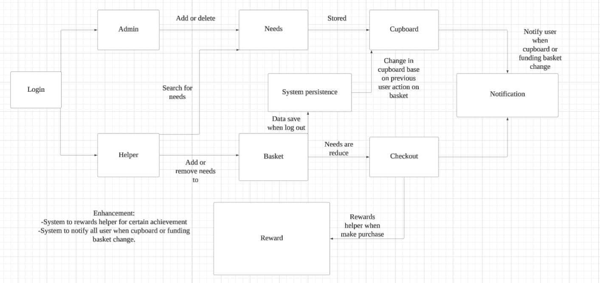

# PROJECT Design Documentation

> _The following template provides the headings for your Design
> Documentation.  As you edit each section make sure you remove these
> commentary 'blockquotes'; the lines that start with a > character
> and appear in the generated PDF in italics but do so only **after** all team members agree that the requirements for that section and current Sprint have been met. **Do not** delete future Sprint expectations._

## Team Information
* Team name: 6f
* Team members
  * Eric Zheng Wu
  * Evan Lin
  * Alexandra Mantagas
  * Sophia Le

## Executive Summary

This project focuses on developing a web platform that facilitates wildfire relief funding by connecting affected communities with potential supporters. It illustrates a team-driven software development process, following the software development lifecycle. Wildfires leave many communities devastated, creating urgent needs for financial aid, essential supplies, and skilled labor for recovery efforts. Wildfire relief organizations often require a more customized solution to effectively manage and track their specific needs. This project aims to bridge that gap by providing a tailored, user-friendly platform to help communities recover efficiently. By streamlining the process of wildfire relief funding, the platform ensures that affected communities receive timely and effective support from willing donors and volunteers.

### Purpose
>  _**[Sprint 2 & 4]** Provide a very brief statement about the project and the most
> important user group and user goals._

### Glossary and Acronyms
> _**[Sprint 2 & 4]** Provide a table of terms and acronyms._

| Term | Definition                       |
|------|----------------------------------|
| SPA  | Single Page                      |
| API  | Application Programming Interface|
| HTTP | Hypertext Transfer Protocol      |
| CRUD | Create, Read, Update, Delete     |
| REST | Representational State Transfer  |
| DAO  | Data Access Object               |

## Requirements

This section describes the features of the application.

> _In this section you do not need to be exhaustive and list every
> story.  Focus on top-level features from the Vision document and
> maybe Epics and critical Stories._

### Definition of MVP
> _**[Sprint 2 & 4]** Provide a simple description of the Minimum Viable Product._

### MVP Features
>  _**[Sprint 4]** Provide a list of top-level Epics and/or Stories of the MVP._

### Enhancements
> _**[Sprint 4]** Describe what enhancements you have implemented for the project._

## Application Domain

This section describes the application domain.

> _**[Sprint 2 & 4]** Provide a high-level overview of the domain for this application. You
> can discuss the more important domain entities and their relationship
> to each other._
>
> User: A person using the system, either a Helper or a U-Fund manager. Can
> interact with Needs and Funding Basket.
> 
> Need: A request for resources. Stored in Cupboard, managed by U-Fund managers,
> funded by Helpers.
>
> Cupboard: Holds all active Needs. Accessed by U-Fund managers.
>
> Funding Basket: A temporary selection of Needs a Helper wants to fund. Belongs to a specific Helper.
>
> Authentication System: Manages user login and role-based access. Determines if user is a Helper or a U-Fund Manager. 

## Architecture and Design

This section describes the application architecture.

### Summary

The following Tiers/Layers model shows a high-level view of the webapp's architecture. 
**NOTE**: detailed diagrams are required in later sections of this document.
> _**[Sprint 1]** (Augment this diagram with your **own** rendition and representations of sample system classes, placing them into the appropriate M/V/VM (orange rectangle) tier section. Focus on what is currently required to support **Sprint 1 - Demo requirements**. Make sure to describe your design choices in the corresponding _**Tier Section**_ and also in the _**OO Design Principles**_ section below.)_

The web application, is built using the Model–View–ViewModel (MVVM) architecture pattern. 

The Model stores the application data objects including any functionality to provide persistance. 

The View is the client-side SPA built with Angular utilizing HTML, CSS and TypeScript. The ViewModel provides RESTful APIs to the client (View) as well as any logic required to manipulate the data objects from the Model.

Both the ViewModel and Model are built using Java and Spring Framework. Details of the components within these tiers are supplied below.

### Overview of User Interface

This section describes the web interface flow; this is how the user views and interacts with the web application.

> _Provide a summary of the application's user interface.  Describe, from the user's perspective, the flow of the pages/navigation in the web application.
>  (Add low-fidelity mockups prior to initiating your **[Sprint 2]**  work so you have a good idea of the user interactions.) Eventually replace with representative screen shots of your high-fidelity results as these become available and finally include future recommendations improvement recommendations for your **[Sprint 4]** )_

### View Tier
> _**[Sprint 4]** Provide a summary of the View Tier UI of your architecture.
> Describe the types of components in the tier and describe their
> responsibilities.  This should be a narrative description, i.e. it has
> a flow or "story line" that the reader can follow._

> _**[Sprint 4]** You must  provide at least **2 sequence diagrams** as is relevant to a particular aspects 
> of the design that you are describing.  (**For example**, in a shopping experience application you might create a 
> sequence diagram of a customer searching for an item and adding to their cart.)
> As these can span multiple tiers, be sure to include an relevant HTTP requests from the client-side to the server-side 
> to help illustrate the end-to-end flow._

> _**[Sprint 4]** To adequately show your system, you will need to present the **class diagrams** where relevant in your design. Some additional tips:_
 >* _Class diagrams only apply to the **ViewModel** and **Model** Tier_
>* _A single class diagram of the entire system will not be effective. You may start with one, but will be need to break it down into smaller sections to account for requirements of each of the Tier static models below._
 >* _Correct labeling of relationships with proper notation for the relationship type, multiplicities, and navigation information will be important._
 >* _Include other details such as attributes and method signatures that you think are needed to support the level of detail in your discussion._

### ViewModel Tier
> _**[Sprint 1]** List the classes supporting this tier and provide a description of there purpose._

> _CupboardController: Implements the REST API endpoints for CRUD operations for wildfire relief needs. It also interacts with
> the CupboardDAO file for data persistence._
>
> _CupboardDAO (interface): Defines the methods for need management, such as retrieving, adding, and updating a need._

> _**[Sprint 4]** Provide a summary of this tier of your architecture. This
> section will follow the same instructions that are given for the View
> Tier above._

> _At appropriate places as part of this narrative provide **one** or more updated and **properly labeled**
> static models (UML class diagrams) with some details such as associations (connections) between classes, and critical attributes and methods. (**Be sure** to revisit the Static **UML Review Sheet** to ensure your class diagrams are using correct format and syntax.)_
> 

### Model Tier
> _**[Sprint 1]** List the classes supporting this tier and provide a description of there purpose._

> _Model:_
> _Need: Represents a single need. Contains the attributes name, cost, quantity, and type. _
> _CupboardFileDAO: Reads and writes needs to a JSON file._

> _**[Sprint 2, 3 & 4]** Provide a summary of this tier of your architecture. This
> section will follow the same instructions that are given for the View
> Tier above._

> _At appropriate places as part of this narrative provide **one** or more updated and **properly labeled**
> static models (UML class diagrams) with some details such as associations (connections) between classes, and critical attributes and methods. (**Be sure** to revisit the Static **UML Review Sheet** to ensure your class diagrams are using correct format and syntax.)_
> 

## OO Design Principles

> _**[Sprint 1]** Name and describe the initial OO Principles that your team has considered in support of your design (and implementation) for this first Sprint._

> _Single Responsibility Principle (SRP): Need is responsible only for storing data about a need._

> _Open/Closed Principle (OCP): CupboardDAO is an interface which allows for future modifications without changing the existing logic._

> _Controller: Component that manages user input and interacts with the model and view to process requests and update the user interface._

> _Pure Fabrication: Designed to improve the overall system by encapsulating complex logic or providing a clean interface between > other classes._
> _Dependency Inversion/Injection:  important parts of the code should not rely on details. They should rely on general ideas or rules. We follow this by using interfaces._

> _Law of Demeter: The object should know as little as possible about the others, basically everything should be private. Other objects should not have direct access to the data. For example, the getters we use._

> _Low Coupling: One person can edit the interface while another team member can work on the backend development at the same time._

> _Low Coupling: The Need class is the information expert for all need-related data._

> _**[Sprint 2, 3 & 4]** Will eventually address upto **4 key OO Principles** in your final design. Follow guidance in augmenting those completed in previous Sprints as indicated to you by instructor. Be sure to include any diagrams (or clearly refer to ones elsewhere in your Tier sections above) to support your claims._

> _**[Sprint 3 & 4]** OO Design Principles should span across **all tiers.**_

## Static Code Analysis/Future Design Improvements
> _**[Sprint 4]** With the results from the Static Code Analysis exercise, 
> **Identify 3-4** areas within your code that have been flagged by the Static Code 
> Analysis Tool (SonarQube) and provide your analysis and recommendations.  
> Include any relevant screenshot(s) with each area._

> _**[Sprint 4]** Discuss **future** refactoring and other design improvements your team would explore if the team had additional time._

## Testing
> _This section will provide information about the testing performed
> and the results of the testing._

### Acceptance Testing
> _**[Sprint 2 & 4]** Report on the number of user stories that have passed all their
> acceptance criteria tests, the number that have some acceptance
> criteria tests failing, and the number of user stories that
> have not had any testing yet. Highlight the issues found during
> acceptance testing and if there are any concerns._
>
> Sprint 2: Login System user story passed all acceptance criteria tests. 

### Unit Testing and Code Coverage
> _**[Sprint 4]** Discuss your unit testing strategy. Report on the code coverage
> achieved from unit testing of the code base. Discuss the team's
> coverage targets, why you selected those values, and how well your
> code coverage met your targets._

>_**[Sprint 2, 3 & 4]** **Include images of your code coverage report.** If there are any anomalies, discuss
> those._

## Ongoing Rationale
>_**[Sprint 1, 2, 3 & 4]** Throughout the project, provide a time stamp **(yyyy/mm/dd): Sprint # and description** of any _**mayor**_ team decisions or design milestones/changes and corresponding justification._
>
> 2025/03/03: Sprint 2, implemented basic login system where user can log in as either a U-Fund Manager or a Helper. 
